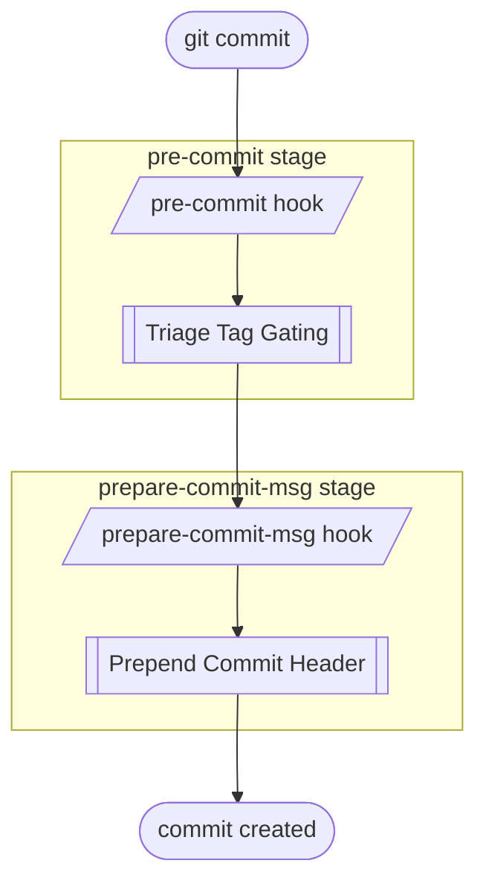

# Hooks Utility Python `hupy` README

> **Hooks Utility Python** — a toolkit for enforcing commit quality via git hooks.

<!--
bug missing feature such that direct bash command can be used
todo add PCH more scenario eg keep up feature branch with dev
todo ban direct commit to main
todo toggle direct commit to dev
-->

> [!NOTE]
> Python reimplementation of the original bash [hooks-utility](https://github.com/kami-lel/hooks-utility).


## ✨ Features

- 🛡️ **Branch protection** — block *annotation markers* (`TODO`, `FIXME`, `HACK`, `BUG`) by severity tier on protected branches
- 📋 **Ensure file edited** — require specific files or line ranges to change as part of a commit
- ✏️ **Improve commit message** — auto-generate better messages for merge commit types
- 🔍 **Commit type detection** — identify commit type (e.g., binary merge) from within a hook


## 📦 Installation

#### Install Python Package

**Clone and install locally**

```bash
git clone https://github.com/kami-lel/hooks-utility-py.git
cd hooks-utility-py
pip install .
```

Or install **directly from GitHub**

```bash
pip install git+https://github.com/kami-lel/hooks-utility-py.git
```


#### Set Up for Repository

Initialize `hupy` inside the git repository to protect:

```bash
python -m hupy init
```

- copies the default hook stub scripts into the repo's hooks directory
- writes a default `.hupy.config.json` at the repository root

See [HUPy File Documentation](docs/hupy_config_doc.md) for **customizing** *HUPy* behavior.


## 🚀 Usage

Once `hupy init` has installed the stubs, the hooks are **fully automatic** — there is nothing extra to run. From then on every `git commit` fires them, and git hands each one to the matching *HUPy* feature:



See the per-feature docs for detailed usage:

- [Triage Tag Gating (TTG)](docs/ttg_doc.md)
- [Prepend Commit Header (PCH)](docs/pch_doc.md)
