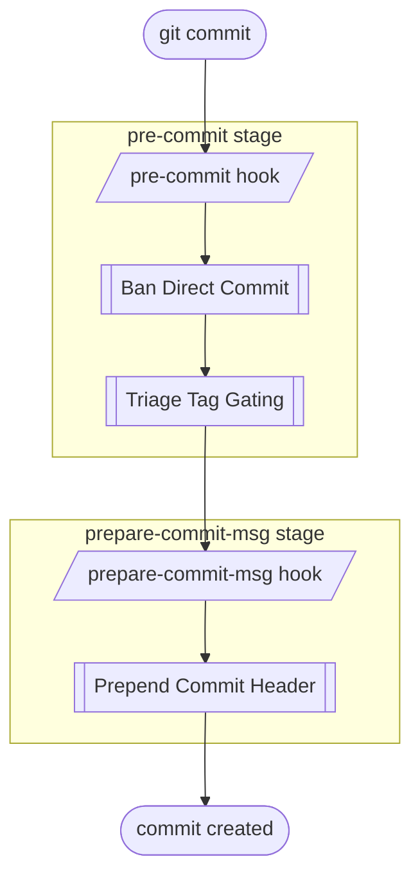

# `hupy` (Hooks Utility Python) README

> a toolkit for enforcing commit quality via git hooks.

> [!NOTE]
> Python reimplementation of the original bash [hooks-utility](https://github.com/kami-lel/hooks-utility).


<!-- FIXME rewrite .hupy.config.jsonc docs
FIXME rewrite all components docs
FIXME rewrite readme

TODO pyproject.toml lacks license.
-->

<!-- todo reimplement ensure file modified -->


## ✨ Features

- 🚫 **Ban Direct Commit** — block commits made directly on a protected branch (`main` by default), while still allowing that branch to receive commits through a merge
- 🛡️ **Triage Tag Gating** — block *annotation markers* (`TODO`, `FIXME`, `HACK`, `BUG`) by severity tier on protected branches
- ✏️ **Prepend Commit Header** — auto-generate descriptive headers for merge commit types, stamping the project version on releases
- 🔍 **Commit/Branch/Merge detection** — classify branch types and in-progress commit types from git state, shared across the hooks above


## 📦 Installation

#### Install Python Package

**Clone and install locally**

```bash
git clone https://github.com/kami-lel/hupy.git
cd hupy
pip install .
```

Or install **directly from GitHub**

```bash
pip install git+https://github.com/kami-lel/hupy.git
```


#### Set Up for Repository

Initialize `hupy` inside the git repository to protect:

```bash
hupy init
```

- copies the default hook stub scripts into the repo's hooks directory
- writes a default `.hupy.config.jsonc` at the repository root

See [HUPy File Documentation](docs/hupy_config_doc.md) for **customizing** *HUPy* behavior.


## 🚀 Usage

Once `hupy init` has installed the stubs, the hooks are **fully automatic** — there is nothing extra to run. From then on every `git commit` fires them, and git hands each one to the matching *HUPy* feature:



See the per-feature docs for detailed usage:

- [Ban Direct Commit (BDC)](docs/hupy_config_doc.md#bdc)
- [Triage Tag Gating (TTG)](docs/ttg_doc.md)
- [Commit, Branch & Merge (CBM) and Prepend Commit Header (PCH)](docs/cbm_doc.md)
