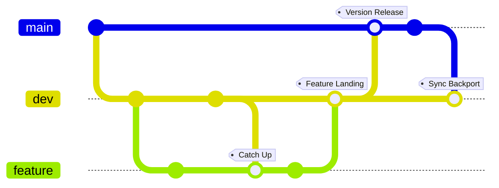
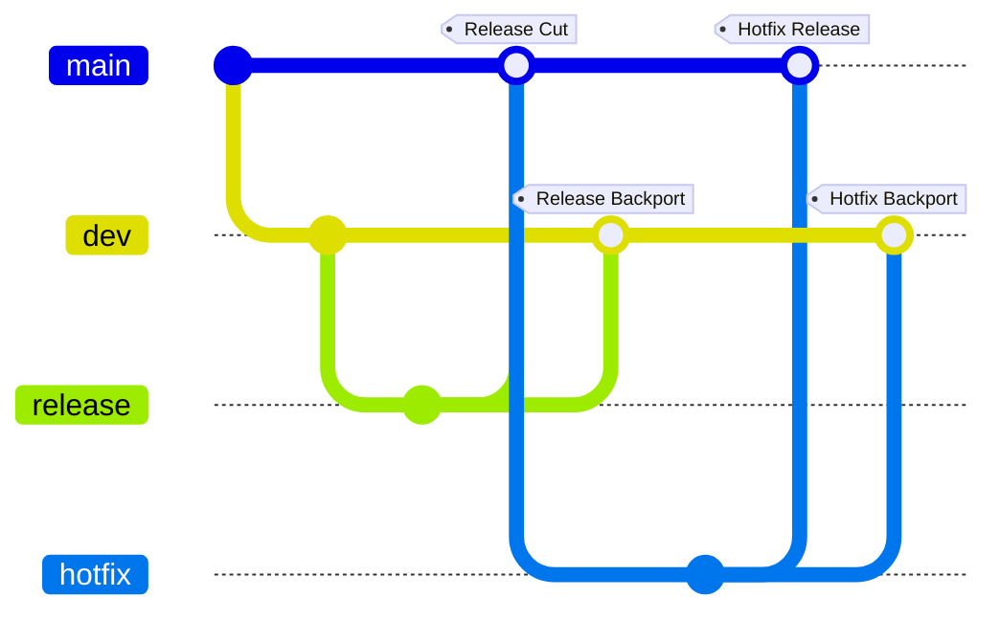

# Commit, Branch & Merge Documentation

## Concepts

### Branch Type

| Branch Type | Default Name | Config File Field | Remarks |
| --- | --- | --- | --- |
| main | `main` | `main_branch_name` | the production-ready branch |
| dev | `dev` | `dev_branch_name` | the shared development branch |
| hotfix | `hotfix/*`, eg `hotfix/crash`| `hotfix_branch_prefix` | urgent fix |
| release | `release/*`, eg `release/1.2` | `release_branch_prefix` | release candidate |
| user | eg `alice/x`  | n/a  | any owned branch |
| feature | eg `add-user-sing-in` | n/a | fallback for a plain feature branch |


### Merge Type

| Merge Type | Direction | Remarks |
| --- | --- | --- |
| Version Release | dev → main | a stable batch ships to production |
| Feature Landing | feature → dev | a finished feature lands on the shared dev line |
| Sync Backport | main → dev | pull a main-only change back so dev doesn't drift |
| Catch Up | dev → feature | bring a feature branch current with dev |
| Hotfix Release | hotfix → main | an urgent fix ships straight to production |
| Hotfix Backport | hotfix → dev | fold that same fix back into dev |
| Release Cut | release → main | finalize and tag a release |
| Release Backport | release → dev | sync last-minute release fixes back to dev |
| Other Merge | any other pair | recognized as a merge, but no known pattern |

**feature ↔ dev ↔ main**: Feature Landing, Catch Up, Version Release, Sync Backport



**hotfix, release → main, dev**: Hotfix Release, Hotfix Backport, Release Cut, Release Backport




## `hupy.cbm` Module

### `get_current_commit_type(repo_path)`

The main entry point of the module. Call it during an in-progress commit (e.g. from a `commit-msg` or `prepare-commit-msg` hook) to find out whether the commit is a plain commit or a merge, and if it's a merge, which of the recognized types it belongs to.

```python
from hupy.cbm import get_current_commit_type, CommitType

commit_type = get_current_commit_type(".")

if commit_type is CommitType.FEATURE_LANDING:
    ...
```

Here the first branch runs when a feature is landing on `dev`, the
second runs for any other kind of merge, and the final `else` runs for
a plain, non-merge commit.

`repo_path` may be the repo root or any path inside it — the repo is
located by walking up from there. Raises
`git.InvalidGitRepositoryError` / `git.NoSuchPathError` if no repo is
found.


### `get_source_branch(repo)` / `get_target_branch(repo)`

Lower-level helpers used internally by `get_current_commit_type`, also useful on their own when only the branch names are needed rather than a full `CommitType`. Both expect an already-open `git.Repo` and only make sense while a merge is in progress (i.e. `MERGE_HEAD` exists):

`get_source_branch` reads the branch being merged *from*, `get_target_branch` reports the currently checked-out branch being merged *into*.

```python
import git
from hupy.cbm import get_source_branch, get_target_branch

repo = git.Repo(".", search_parent_directories=True)
get_source_branch(repo)
get_target_branch(repo)
```

For a feature branch being merged into `dev`, `get_source_branch`
returns something like `"add-login"` and `get_target_branch` returns
`"dev"`.

`get_target_branch` returns `None` on a detached `HEAD`, since there is
no named branch to report.


## `hupy.pch` Module

**Prepend Commit Header** is *HUPy*'s `prepare-commit-msg` hook. When you make a **merge commit**, it adds a short header line to the top of the commit message so the history reads clearly at a glance — you don't have to write it yourself.

It recognizes every merge type listed under [Merge Type](#merge-type) above and leaves every other commit (`OTHER_COMMIT`, `OTHER_MERGE`) untouched. The header goes on the first line, followed by a blank line and then git's original message:

```
Feature Landing: add-user-auth

Merge branch 'add-user-auth' into dev
```


### `prepend_commit_header(repo)`

The main entry point of the module. Call it during an in-progress commit (e.g. from a `prepare-commit-msg` hook) to prepend the appropriate header to `COMMIT_EDITMSG`, based on the commit type reported by `get_current_commit_type`.

```python
import git
from hupy.pch import prepend_commit_header

repo = git.Repo(".", search_parent_directories=True)
prepend_commit_header(repo)
```

`repo` must be an already-open `git.Repo`.


## `hupy.ver_grep` Module

Extracts a repo's version string by regex-matching a line in a configured version file. *PCH* uses it to fill in the `<version>` placeholder on the merge types below; if `ver_grep` isn't configured, the header falls back to the plain form with no number.

See [`.hupy.config.json` Documentation](hupy_config_doc.md#ver_grep) to set it up.


### `grep_source_branch_version()` / `grep_target_branch_version()`

Read straight from each branch's own tip via git — the working tree mid-merge holds the (possibly conflicted) target branch content, not either branch cleanly. `grep_source_branch_version` reads the merge's incoming branch, `grep_target_branch_version` reads the currently checked-out branch.

```python
from hupy.ver_grep import grep_source_branch_version, grep_target_branch_version

grep_source_branch_version()
grep_target_branch_version()
```

Both take no arguments — they resolve the repo from the current working directory and read `get_source_branch` / `get_target_branch` internally. Both return `""` if `ver_grep` isn't configured, and raise `SystemExit` if the version file isn't found on that branch or the pattern matches no line.
