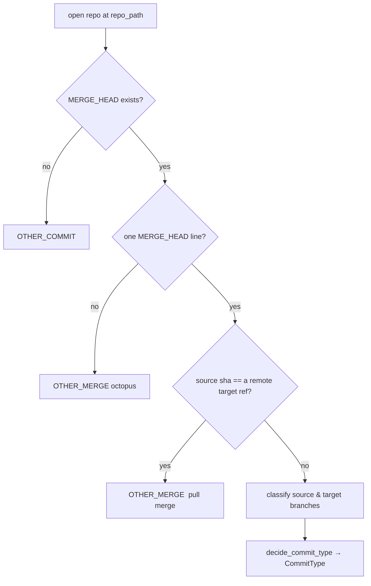

# Commit, Branch & Merge Documentation

<!-- FIXME manually rewrite -->

The **CBM** module (`hupy.cbm`) inspects a git repository's live state to
classify the *in-progress* commit — telling a plain commit from a merge,
and each merge from the branch pair it joins.

It reads the working repository directly (`MERGE_HEAD`, the active
branch, remote refs); it never rewrites history or touches the index.

## Public API

Everything below is re-exported from `hupy.cbm`.

| Name | Kind | Purpose |
| --- | --- | --- |
| `get_current_commit_type` | function | classify the in-progress commit for a repo path |
| `get_source_branch` | function | resolve the branch being merged from |
| `get_target_branch` | function | resolve the branch being merged into |
| `CommitType` | `Flag` enum | the commit / merge taxonomy |
| `BranchType` | `Enum` | single-branch classifier backing the taxonomy |

## BranchType

`BranchType` classifies a single branch by its name, using the repo's
`cbm` config section for the defining names and prefixes.

| Member | Matches when branch name… | Default |
| --- | --- | --- |
| `MAIN` | equals `main_branch_name` | `main` |
| `DEV` | equals `dev_branch_name` | `dev` |
| `HOTFIX` | starts with `hotfix_branch_prefix + "/"` | `hotfix/…` |
| `RELEASE` | starts with `release_branch_prefix + "/"` | `release/…` |
| `USER` | contains `/` but matches none above | e.g. `alice/x` |
| `FEATURE` | anything else (fallback) | e.g. `add-login` |

```python
BranchType.from_name("hotfix/crash", repo_path)  # BranchType.HOTFIX
BranchType.from_name("add-login", repo_path)      # BranchType.FEATURE
```

Order matters: exact names win over prefixes, prefixes win over the
generic `/` rule, and `FEATURE` is the final fallback.

## CommitType

`CommitType` is a two-level `Flag`. Level 1 splits merges from
everything else; level 2 refines a merge by its branch pair. Every merge
member carries the `MERGE` bit, so `CommitType.MERGE in value` tests
"is this any kind of merge".

### Level 1 — commit vs merge

| Member | Meaning |
| --- | --- |
| `OTHER_COMMIT` | a regular, non-merge commit |
| `MERGE` | the shared bit on every merge member |

### Level 2 — merge by branch pair

The pair is `(source, target)` — merging *source* **into** *target*.

| Member | Pair | Meaning |
| --- | --- | --- |
| `FEATURE_LANDING` | `feature → dev` | a finished feature lands on the shared dev line |
| `VERSION_RELEASE` | `dev → main` | a stable batch ships to production |
| `SYNC_BACKPORT` | `main → dev` | pull a main-only change back so dev doesn't drift |
| `CATCH_UP` | `dev → feature` | bring a feature branch current with dev |
| `HOTFIX_RELEASE` | `hotfix/* → main` | an urgent fix ships straight to production |
| `HOTFIX_BACKPORT` | `hotfix/* → dev` | fold that same fix back into dev |
| `RELEASE_CUT` | `release/* → main` | finalize and tag a release |
| `RELEASE_BACKPORT` | `release/* → dev` | sync last-minute release fixes back to dev |
| `OTHER_MERGE` | any other pair | recognized as a merge, but no known pattern |

Pairs are looked up in `_MERGE_TYPE_BY_BRANCH_PAIR`; an unknown pair
falls back to `OTHER_MERGE`.

```python
CommitType.decide_commit_type(BranchType.FEATURE, BranchType.DEV)
# CommitType.FEATURE_LANDING

CommitType.decide_commit_type(BranchType.USER, BranchType.MAIN)
# CommitType.OTHER_MERGE  (unrecognized pair)
```

## Detection flow

`get_current_commit_type(repo_path)` drives the whole classification:



Step by step:

- opens the repo with `search_parent_directories=True`, so `repo_path`
  may be the root or any path inside it
- no `MERGE_HEAD` file means no merge is staged → `OTHER_COMMIT`
- more than one `MERGE_HEAD` line is an octopus merge → `OTHER_MERGE`
- a source sha matching a remote copy of the target branch is treated as
  a pull-style merge → `OTHER_MERGE`
- otherwise both branches are resolved to `BranchType` and handed to
  `CommitType.decide_commit_type`

### Source & target resolution

- **target** is the active branch name; a detached `HEAD` yields `None`,
  which flows through as an `OTHER_MERGE`
- **source** is read from `MERGE_HEAD`: the sha is matched against local
  branch tips, falling back to `git name-rev --name-only`

## Caching

Three module-level dicts memoize results for the lifetime of the
process, keyed as noted:

| Cache | Key | Filled by |
| --- | --- | --- |
| `_source_branch_cache` | `repo.git_dir` | `get_source_branch` |
| `_target_branch_cache` | `repo.git_dir` | `get_target_branch` |
| `_commit_type_cache` | `repo_path` | `get_current_commit_type` |

The caches assume the repository state is stable across a run; they are
not invalidated when git state changes mid-process.

## Configuration

The branch-naming knobs come from the `cbm` section of the HUPy config
file (see [hupy_config_doc.md](hupy_config_doc.md)):

| Field | Default | Role |
| --- | --- | --- |
| `main_branch_name` | `main` | defines `BranchType.MAIN` |
| `dev_branch_name` | `dev` | defines `BranchType.DEV` |
| `hotfix_branch_prefix` | `hotfix` | prefix for `BranchType.HOTFIX` |
| `release_branch_prefix` | `release` | prefix for `BranchType.RELEASE` |

Config is loaded per call via `load_hupy_config(repo_path)`, so renaming
a branch convention takes effect without code changes.

## Logging

The module logs classification decisions at `DEBUG` under
`CBM_LOGGER_NAME` (`"<PROJ_LOGGER_NAME>.CBM"`). The logger's `propagate`
is disabled, keeping CBM output off the parent handlers.

## Usage

```python
from hupy.cbm import get_current_commit_type, CommitType

commit_type = get_current_commit_type(".")

if commit_type is CommitType.FEATURE_LANDING:
    ...                              # a feature is landing on dev
elif CommitType.MERGE in commit_type:
    ...                              # some other merge
else:
    ...                              # a plain commit
```

`get_current_commit_type` raises `git.InvalidGitRepositoryError` when no
repo is found at or above `repo_path`, and `git.NoSuchPathError` when the
path does not exist.
