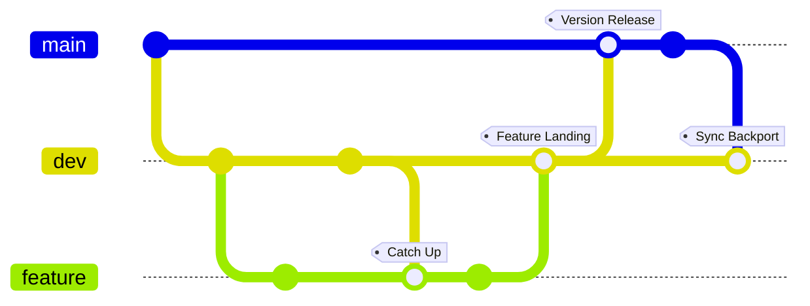
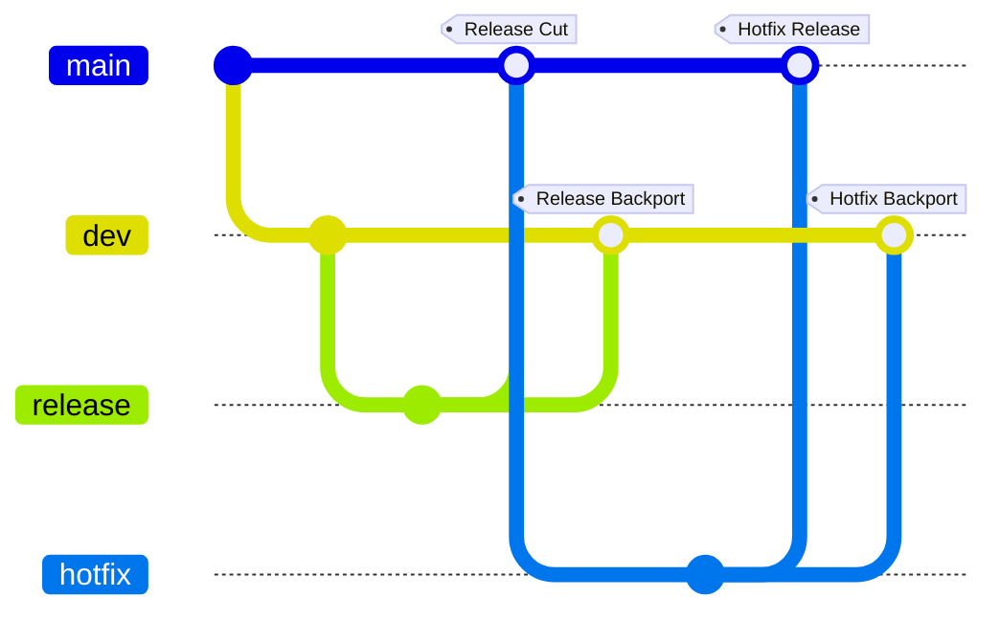

# Commit, Branch & Merge Documentation

CBM classifies branch types and in-progress merge types from git state; this classification is shared by [Ban Direct Commit](bdc_doc.md), [Triage Tag Gating](ttg_doc.md), [Prepend Commit Header](pch_doc.md), and [Hook Bracket](hb_doc.md). See the [Hook Flow](flow_doc.md) for how these features run together.

### Branch Type

| Branch Type | Default Name | Config File Field | Remarks |
| --- | --- | --- | --- |
| main | `main` | `main_branch_name` | the production-ready branch |
| dev | `dev` | `dev_branch_name` | the shared development branch |
| hotfix | `hotfix/*`, eg `hotfix/crash`| `hotfix_branch_prefix` | urgent fix |
| release | `release/*`, eg `release/1.2` | `release_branch_prefix` | release candidate |
| user | eg `alice/x`  | n/a  | any owned branch |
| feature | eg `add-user-sing-in` | n/a | fallback for a plain feature branch |

### Merge Type

| Merge Type | Direction | Remarks |
| --- | --- | --- |
| Version Release | dev → main | a stable batch ships to production |
| Feature Landing | feature → dev | a finished feature lands on the shared dev line |
| Sync Backport | main → dev | pull a main-only change back so dev doesn't drift |
| Catch Up | dev → feature | bring a feature branch current with dev |
| Hotfix Release | hotfix → main | an urgent fix ships straight to production |
| Hotfix Backport | hotfix → dev | fold that same fix back into dev |
| Release Cut | release → main | finalize and tag a release |
| Release Backport | release → dev | sync last-minute release fixes back to dev |
| Other Merge | any other pair | recognized as a merge, but no known pattern |

**feature ↔ dev ↔ main**: Feature Landing, Catch Up, Version Release, Sync Backport

**hotfix, release → main, dev**: Hotfix Release, Hotfix Backport, Release Cut, Release Backport

