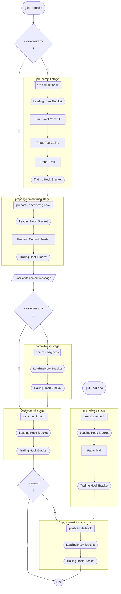
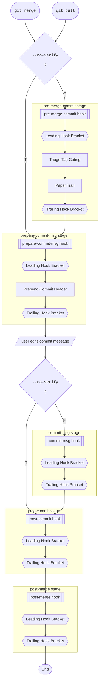
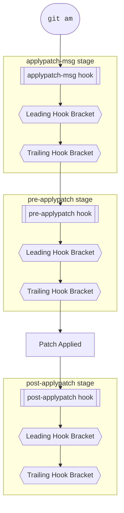

# Hook Chain Documentation

<!-- Todo make sure each feature occurs in all appr locations -->

Running a single `git` command can trigger a sequence of hooks, with *HUPy* running its matching features at each one according to your settings. This project's term for that full sequence — every hook stage a given git operation triggers, start to finish — is a **chain**.

Within each hook **stage**, execution always opens with *Leading Hook Bracket* and closes with *Trailing Hook Bracket*; q.v. [Hook Bracket](hb_doc.md) for details.

## Commit Chain

Triggered by a **non-merge** `git commit` (a merge commit follows the [Merge Chain](#merge-chain) instead), or by `git rebase`:

[Ban Direct Commit](bdc_doc.md) blocks direct commits to protected branches, [Triage Tag Gating](ttg_doc.md) blocks merges that still carry unresolved triage tags, [Paper Trail](pt_doc.md) requires configured files to have changed alongside the commit, and [Prepend Commit Header](pch_doc.md) adds a header line to merge commit messages — see each doc for the full behavior.

## Merge Chain

Triggered by `git merge`, or by `git pull` (which runs a merge under the hood):

See [Triage Tag Gating](ttg_doc.md) for its merge-gating behavior, [Paper Trail](pt_doc.md) for its changed-file requirement, and [Prepend Commit Header](pch_doc.md) for its merge-commit header logic.

## Patch Apply Chain

Triggered by `git am`.

## Standalone Hooks

Each hook below fires on its own trigger, independent of the Chains above — it never joins one of those Chains, nor chains with any other hook in this list.

- `pre-auto-gc`
- `post-index-change`
- `sendemail-validate`
- `fsmonitor-watchman`
- `post-checkout`
- `pre-push`

----

> [!NOTE]
> `applypatch-msg`, `pre-applypatch`, `post-applypatch`, `commit-msg`, `post-rewrite`, `pre-auto-gc`, `post-index-change`, `sendemail-validate`, `fsmonitor-watchman`, `post-checkout`, `post-merge`, and `pre-push` currently run only their [Hook Bracket](hb_doc.md) *lead*/*trail* commands — no dedicated *HUPy* feature is wired into them yet.
