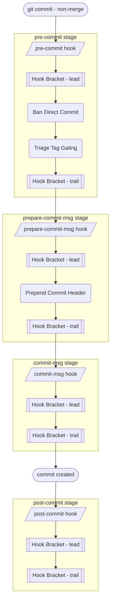
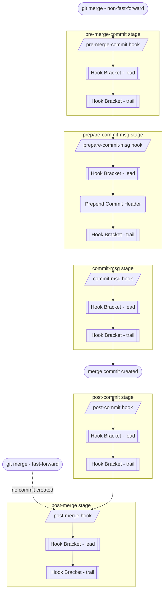
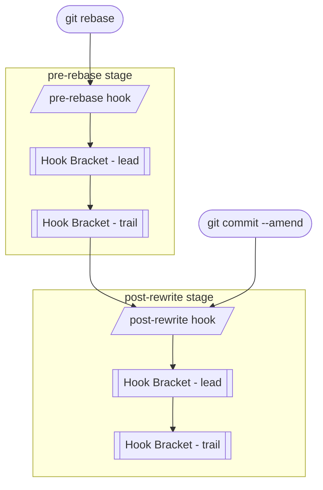
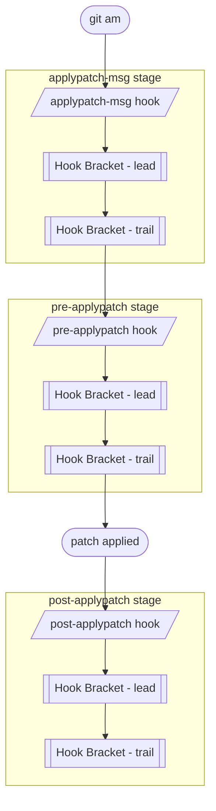
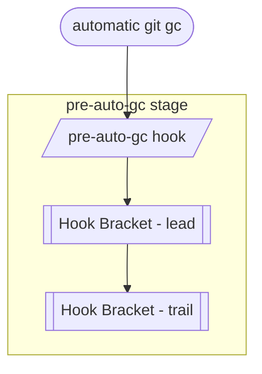
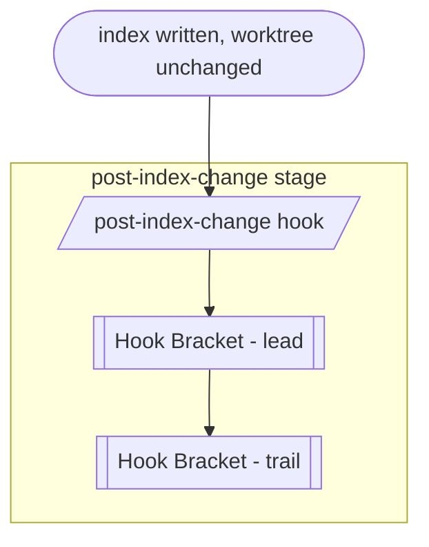
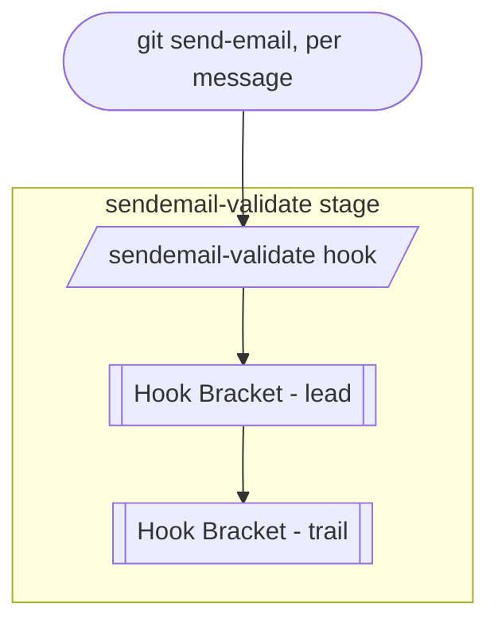
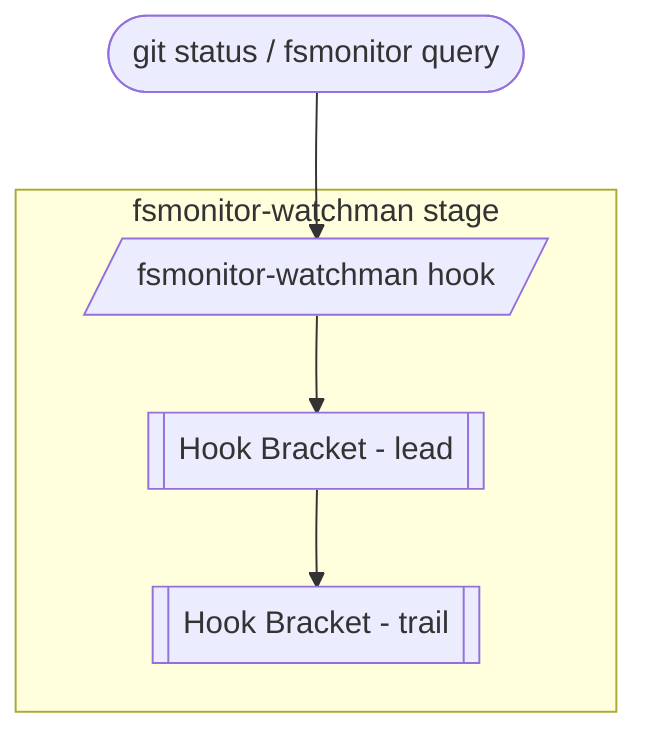
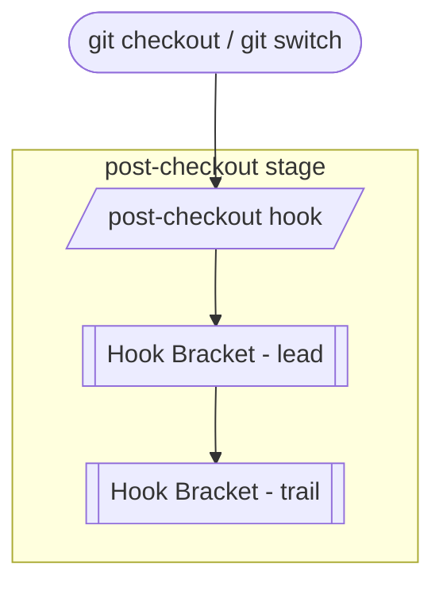
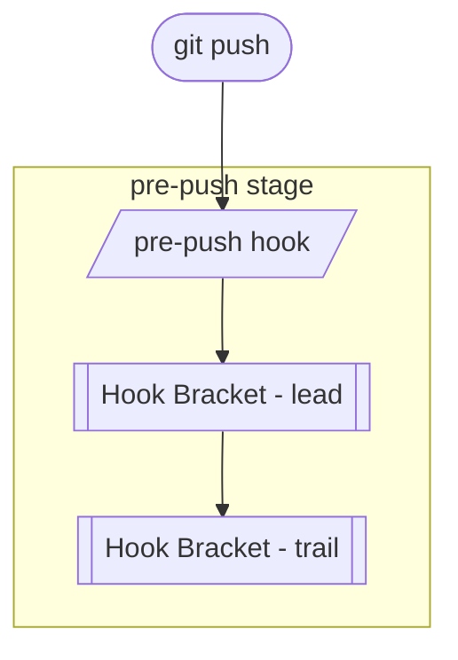

# Hook Flow Documentation

Once `hupy init` has installed the stubs, the hooks are **fully automatic** — every `git commit` fires them in git's own order, and git hands each stage to the matching *HUPy* feature. Each stage's own logic is wrapped by a [Hook Bracket](hb_doc.md) — configured *lead* commands run before it, *trail* commands after:

## Commit Flow

Triggered by `git commit` for a **non-merge commit** (a merge commit follows [Merge Flow](#merge-flow) instead):

See the per-feature docs for what each stage does: [Ban Direct Commit](bdc_doc.md), [Triage Tag Gating](ttg_doc.md), and [Prepend Commit Header](pch_doc.md). Both BDC and PCH decide their behavior from the branch and merge classification in [Commit, Branch & Merge](cbm_doc.md).

## Merge Flow

Triggered by `git merge`. A non-fast-forward merge runs its own commit chain (`pre-merge-commit` → `prepare-commit-msg` → `commit-msg` → `post-commit`) and only fires `post-merge` once that finishes; a fast-forward merge creates no commit at all, so it skips straight to `post-merge`:

## Rewrite Flow

Triggered by `git commit --amend` or `git rebase` — separate from, and does not follow, the commit flow above. `git rebase` also fires `pre-rebase` first, before it starts replaying commits:

## Patch Apply Flow

Triggered by `git am` — separate from, and does not follow, the commit flow above:

## Standalone Hooks

Each of these fires on its own, unrelated trigger — none of them chain into the flows above, or into each other.

### `pre-auto-gc`

Triggered before automatic garbage collection:

### `post-index-change`

Triggered when the index is written and the working tree is unchanged:

### `sendemail-validate`

Triggered by `git send-email`, once per outgoing message:

### `fsmonitor-watchman`

Triggered by `git status` and other commands querying the filesystem-monitor state:

### `post-checkout`

Triggered after `git checkout` or `git switch` updates the working tree:

### `pre-push`

Triggered before `git push` updates the remote's refs:

> [!NOTE]
> `applypatch-msg`, `pre-applypatch`, `post-applypatch`, `pre-merge-commit`, `commit-msg`, `post-rewrite`, `pre-rebase`, `pre-auto-gc`, `post-index-change`, `sendemail-validate`, `fsmonitor-watchman`, `post-checkout`, `post-merge`, and `pre-push` currently run only their [Hook Bracket](hb_doc.md) *lead*/*trail* commands — no dedicated *HUPy* feature is wired into them yet.
