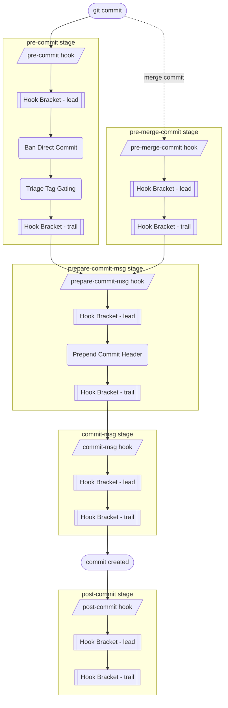
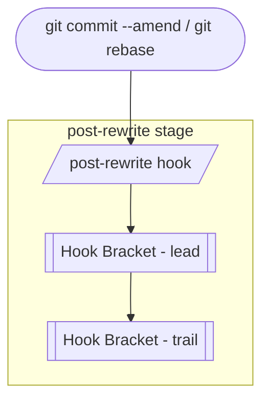

# Hook Flow Documentation

Once `hupy init` has installed the stubs, the hooks are **fully automatic** — every `git commit` fires them in git's own order, and git hands each stage to the matching *HUPy* feature. Each stage's own logic is wrapped by a [Hook Bracket](hb_doc.md) — configured *lead* commands run before it, *trail* commands after:

### Commit Flow

Triggered by `git commit` (a merge commit takes the `pre-merge-commit` branch instead of `pre-commit`):

See the per-feature docs for what each stage does: [Ban Direct Commit](bdc_doc.md), [Triage Tag Gating](ttg_doc.md), and [Prepend Commit Header](pch_doc.md). Both BDC and PCH decide their behavior from the branch and merge classification in [Commit, Branch & Merge](cbm_doc.md).

### Rewrite Flow

Triggered by `git commit --amend` or `git rebase` — separate from, and does not follow, the commit flow above:

> [!NOTE]
> `pre-merge-commit`, `commit-msg`, and `post-rewrite` currently run only their [Hook Bracket](hb_doc.md) *lead*/*trail* commands — no dedicated *HUPy* feature is wired into them yet.
