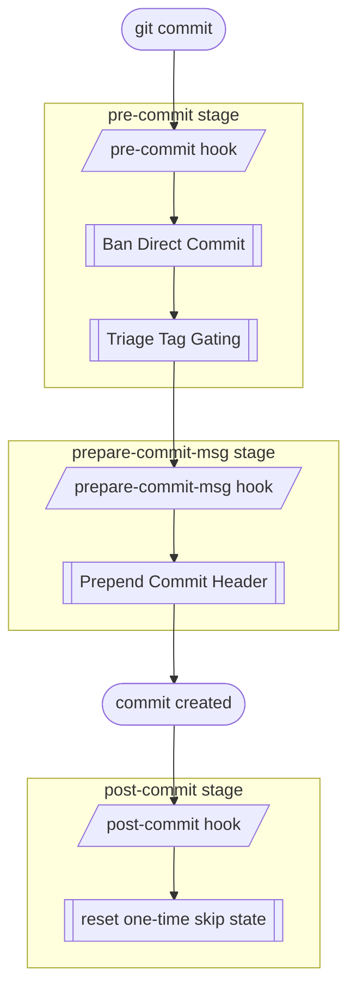

# Hook Flow Documentation

Once `hupy init` has installed the stubs, the hooks are **fully automatic** — every `git commit` fires them in git's own order, and git hands each stage to the matching *HUPy* feature:

Each stub is a thin trampoline invoking `hupy hook <stage>`:

- **`pre-commit`** — runs [Ban Direct Commit](bdc_doc.md) then [Triage Tag Gating](ttg_doc.md)
- **`prepare-commit-msg`** — runs [Prepend Commit Header](pch_doc.md)
- **`post-commit`** — spends the round's one-time `skip-once` flags (`hupy-state.json`), so they apply once and then clear

Any stage's module can be skipped for the next commit with `hupy skip-once <module>` (undo with `-u`).
