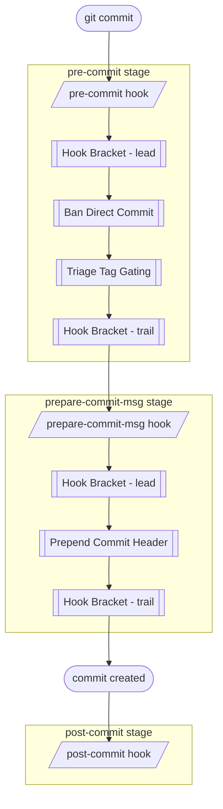

# Hook Flow Documentation

Once `hupy init` has installed the stubs, the hooks are **fully automatic** — every `git commit` fires them in git's own order, and git hands each stage to the matching *HUPy* feature. Each stage's own logic is wrapped by a **Hook Bracket** — configured *lead* commands run before it, *trail* commands after:

Each stub is a thin trampoline invoking `hupy hook <stage>`:

- **`pre-commit`** — [Hook Bracket](hb_doc.md) lead → [Ban Direct Commit](bdc_doc.md) → [Triage Tag Gating](ttg_doc.md) → Hook Bracket trail
- **`prepare-commit-msg`** — [Hook Bracket](hb_doc.md) lead → [Prepend Commit Header](pch_doc.md) → Hook Bracket trail
- **`post-commit`** — runs after the commit is created

Any stage's module can be skipped for the next commit with `hupy skip-once <module>` (undo with `-u`).
