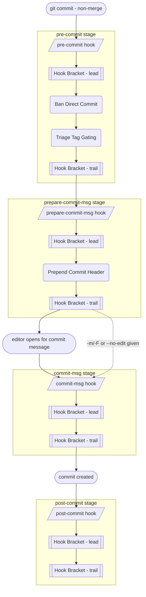
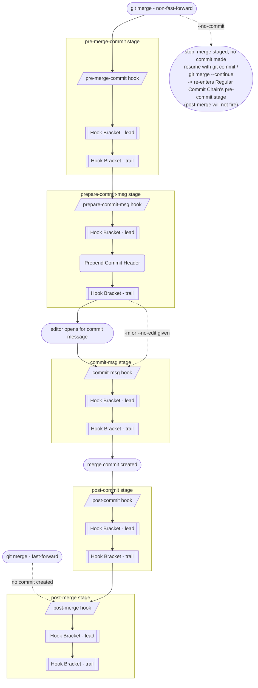
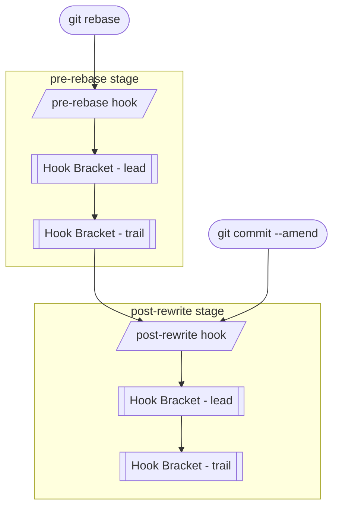
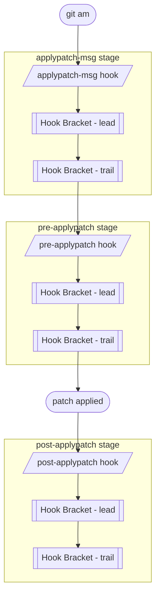
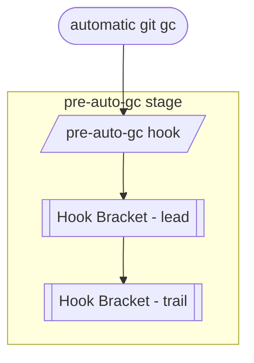
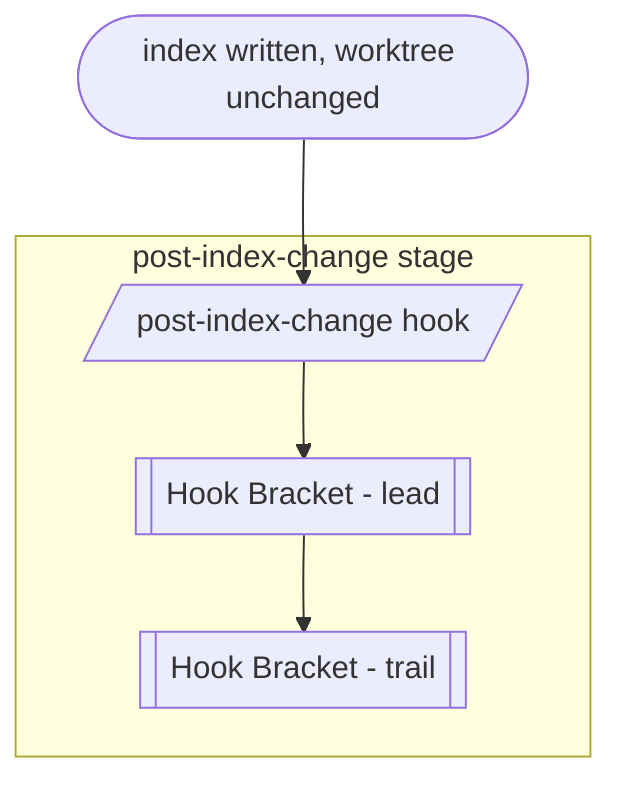
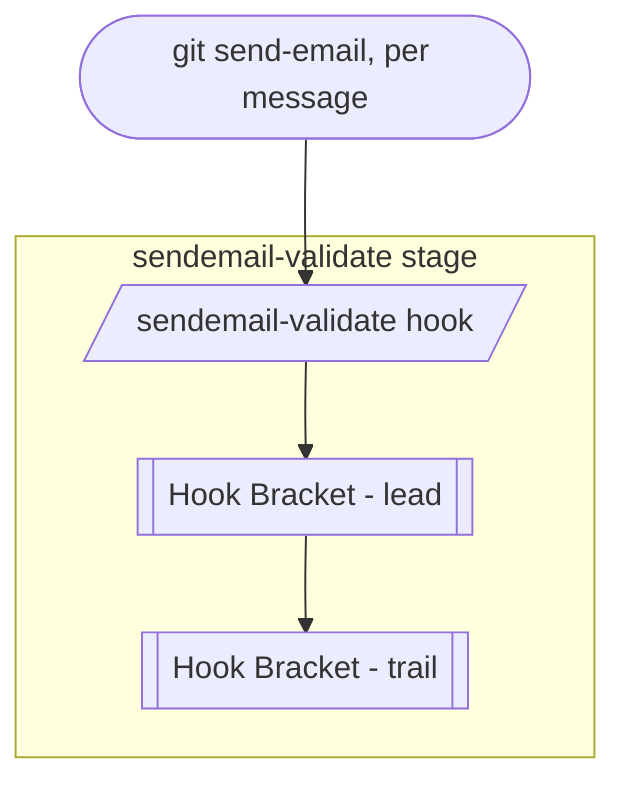
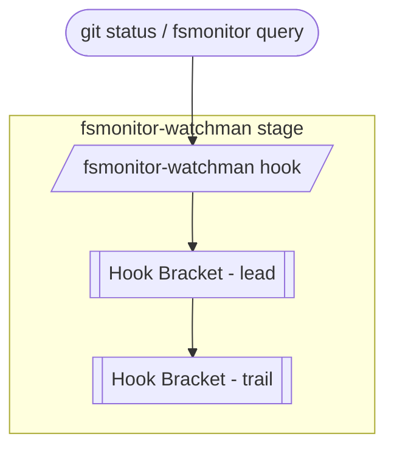
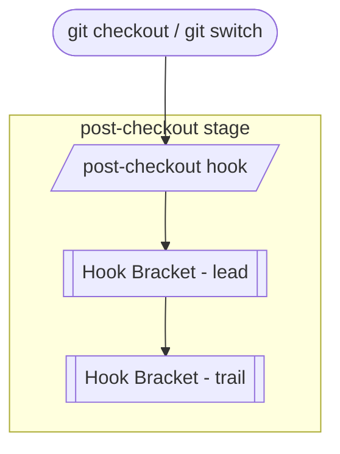
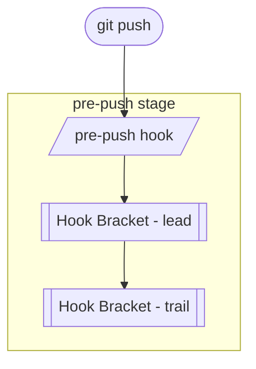

# Hook & Hook Chain Documentation

## Hooks & `hupy`

Once `hupy init` has installed the stubs, the hooks are **fully automatic** — every `git commit` fires them in git's own order, and git hands each stage to the matching *HUPy* feature. Each stage's own logic is wrapped by a [Hook Bracket](hb_doc.md) — configured *lead* commands run before it, *trail* commands after. A **Chain** is the term for the ordered run of hook stages that one git operation triggers, start to finish:

<!-- FIXME FIXME clean up chain doc -->

### Hook Stub Auto-Determination

`hupy` doesn't install a stub for every git hook name that exists — it only installs one for hooks it actually needs. On each `init`/`verify` run, it walks every hook stage module under [`hupy/cli/hooks/`](../hupy/cli/hooks/) (`pre_commit.py`, `prepare_commit_msg.py`, `commit_msg.py`, and so on), each of which declares its git hook name via a `HOOK_NAME` constant (eg `HOOK_NAME = "pre-commit"`). A hook name is **demanded** — and so gets a stub — when at least one of the following holds:

- the module defines `run_core`, meaning it owns a dedicated *HUPy* feature (eg `pre_commit.py` wires up Ban Direct Commit and Triage Tag Gating)
- the module defines `run_after`
- its [Hook Bracket](hb_doc.md) is active — HB isn't disabled in `.hupy.config.jsonc`, and that hook's bracket has at least one configured *lead* or *trail* command

A module satisfying none of these is skipped, and no stub is installed for it. This is why the [Standalone Hooks](#standalone-hooks) below — like `pre-auto-gc` or `pre-push` — only get a stub once the user configures a Hook Bracket for them; per the note at the bottom of this document, they don't carry a dedicated *HUPy* feature yet.

Each installed stub is a thin generated shell script — no on-disk template, no placeholder substitution — that just shells out to `python -m hupy hook <hook-name> "$@"`. That `hook` subcommand is what actually runs the Hook Bracket *lead* → the stage's `run_core` → the Hook Bracket *trail* → `run_after`, for that hook name.

### Managing Stubs: `hupy init` & `hupy verify`

`hupy init` performs first-time setup for a repository:

- installs every demanded hook stub into the repo's hooks directory (`core.hooksPath` if configured, else `.git/hooks/`; override with `--hooks-dir`)
- creates a default `.hupy.config.jsonc` config file at the repository root
- aborts if a demanded stub or the config file already exists, unless `-f`/`--force` overwrites it
- can be narrowed to just one step with `--install-hook-stubs` or `--create-config-file`

`hupy verify` re-checks an already-initialized repository, including whether its stubs are still in sync with current demand — demand can drift after editing `.hupy.config.jsonc` (eg toggling a Hook Bracket) or upgrading `hupy` itself:

- by default, `verify` only reports drift: a **missing hook stub** warning for a demanded hook with no installed stub, and a **hook stub no longer demanded** warning for an installed stub whose hook is no longer demanded
- `-u`/`--update-hook-stubs` turns reporting into action, removing no-longer-demanded stubs and adding missing ones
- `-f`/`--force`, combined with `-u`, additionally regenerates every stub that's both demanded and already installed, eg to pick up a newer stub template after a `hupy` upgrade

`verify` also confirms the config file loads and validates against its schema, and that a version string can be grepped per the VerGrep config, before reporting on hook stub sync.

## Regular Commit Chain

Triggered by `git commit` for a **non-merge commit** (a merge commit follows the [Merge Chain](#merge-chain) instead):

Unless `-m`, `-F`, or `--no-edit` is given, `prepare-commit-msg` hands off to a user-editable editor for the commit message before `commit-msg` runs.

See the per-feature docs for what each stage does: [Ban Direct Commit](bdc_doc.md), [Triage Tag Gating](ttg_doc.md), and [Prepend Commit Header](pch_doc.md). Both BDC and PCH decide their behavior from the branch and merge classification in [Commit, Branch & Merge](cbm_doc.md).

## Merge Chain

Triggered by `git merge`. A non-fast-forward merge runs its own commit chain (`pre-merge-commit` → `prepare-commit-msg` → `commit-msg` → `post-commit`) and only fires `post-merge` once that finishes; a fast-forward merge creates no commit at all, so it skips straight to `post-merge`. `git merge --no-commit` stops before that chain even starts, leaving the merge staged in the index and working tree; a later `git commit` or `git merge --continue` finishes it, but that resumes through the Regular Commit Chain's `pre-commit` stage instead, so `post-merge` never fires for that merge:

## Rewrite Chain

Triggered by `git commit --amend` or `git rebase` — separate from, and does not follow, the Chains above. `git rebase` also fires `pre-rebase` first, before it starts replaying commits:

## Patch Apply Chain

Triggered by `git am` — separate from, and does not follow, the Chains above:

## Standalone Hooks

Each of these fires on its own, unrelated trigger — none of them join the Chains above, and they don't chain into each other either.

### `pre-auto-gc`

Triggered before automatic garbage collection:

### `post-index-change`

Triggered when the index is written and the working tree is unchanged:

### `sendemail-validate`

Triggered by `git send-email`, once per outgoing message:

### `fsmonitor-watchman`

Triggered by `git status` and other commands querying the filesystem-monitor state:

### `post-checkout`

Triggered after `git checkout` or `git switch` updates the working tree:

### `pre-push`

Triggered before `git push` updates the remote's refs:

> [!NOTE]
> `applypatch-msg`, `pre-applypatch`, `post-applypatch`, `pre-merge-commit`, `commit-msg`, `post-rewrite`, `pre-rebase`, `pre-auto-gc`, `post-index-change`, `sendemail-validate`, `fsmonitor-watchman`, `post-checkout`, `post-merge`, and `pre-push` currently run only their [Hook Bracket](hb_doc.md) *lead*/*trail* commands — no dedicated *HUPy* feature is wired into them yet.
